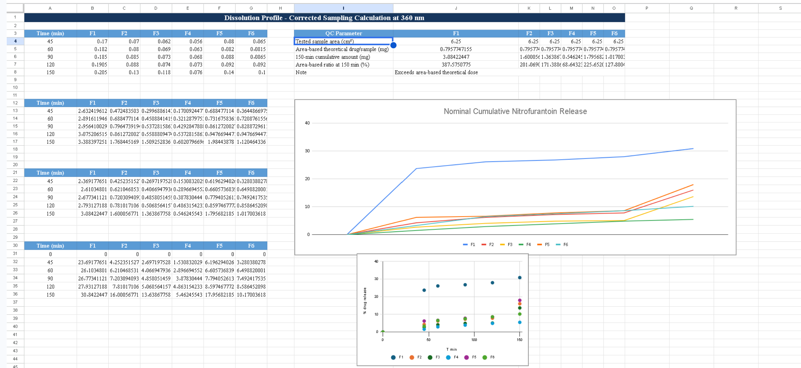
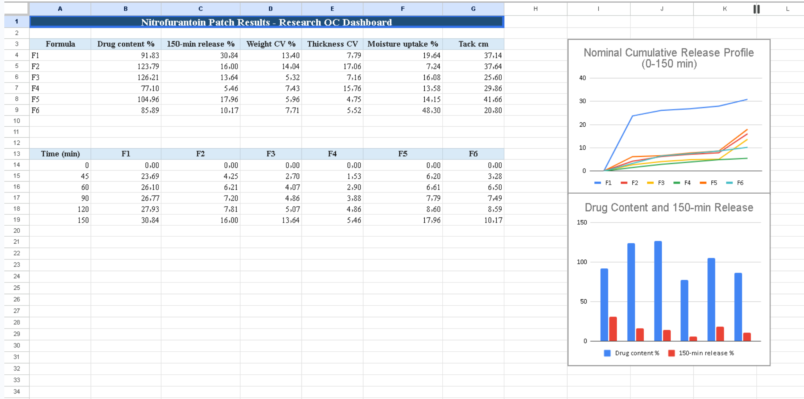

# Nitrofurantoin Research Data Analysis
AI-assisted data analysis for Nitrofurantoin transdermal film research.

## Overview
This project presents the structured analysis of experimental data from my pharmacy graduation research on the formulation and in-vitro evaluation of Nitrofurantoin-containing polymeric films.
The workflow included data organization, quality-control calculations, visualization, drug-content analysis, in-vitro release analysis, release-kinetic modeling, and comparative formulation assessment.

*My role*:
Experimental data collection, AI-assisted data structuring and analysis, manual validation of outputs, and scientific interpretation of findings.
### Calibration Curve

### Nominal Cumulative Release

### QC Dashboard

## Tools
Microsoft Excel • AI-assisted workflows • Data visualization • Quality control
## Research Focus
Pharmaceutical formulation • Transdermal drug delivery • Experimental data analysis • Research validation
